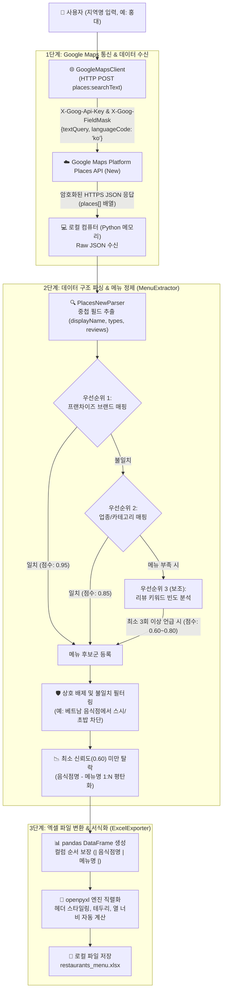

# 🍽️ Google Places API (New) 기반 음식점 & 메뉴 데이터 수집 프로그램 (V0)

음식 랜덤 추천 서비스에 활용할 기초 데이터를 확보하기 위한 Python 프로그램입니다.  
**2026년 기준 최신 Google Maps Platform Places API (New) REST 엔드포인트**를 연동하여 특정 지역의 음식점 목록을 검색하고 메뉴 정보를 매핑하여 엑셀 파일(`restaurants_menu.xlsx`)로 저장합니다.

> 🚨 **Legacy API 완전 배제 (2026 최신 규격 준수)**
> - 구형 Legacy 엔드포인트(`/maps/api/place/textsearch/json`, `/maps/api/place/nearbysearch/json`, `/maps/api/place/details/json`) 및 구형 SDK(`googlemaps`)를 전혀 사용하지 않습니다.
> - **Google Places API (New)** REST 규격(`places.googleapis.com/v1/...`)과 필수 헤더(`X-Goog-Api-Key`, `X-Goog-FieldMask`)를 적용하여 모듈화 구현되었습니다.

---

## 📌 주요 특징

- **최신 Places API (New) REST 규격 적용**:
  - `Text Search (New)`: `POST https://places.googleapis.com/v1/places:searchText`
  - `Nearby Search (New)`: `POST https://places.googleapis.com/v1/places:searchNearby`
  - `Place Details (New)`: `GET https://places.googleapis.com/v1/places/{placeId}`
  - `X-Goog-FieldMask` 및 `X-Goog-Api-Key` 헤더 기반 정밀 필드 요청
- **New API 응답 데이터 포맷 최적화**:
  - `displayName.text`, `id`, `editorialSummary.text`, `reviews[].text.text` 구조 전용 파서(`PlacesNewParser`) 내장
- **기능별 모듈화 아키텍처**:
  - `google_maps_client.py`: Places API (New) 통신 및 데이터 파싱 모듈
  - `menu_extractor.py`: 메뉴 및 키워드 추출 모듈
  - `excel_exporter.py`: 엑셀 서식화 및 파일 저장 모듈
  - `config.py`: 엔드포인트 및 환경 변수 설정
- **보안 설정 (.env)**: API 키 등 민감 정보를 `.env` 파일로 안전하게 분리
- **테스트/샘플 모드 지원**: API 키 발급 전에도 Places API (New) 규격의 샘플 데이터를 통해 데이터 수집 및 엑셀 생성 파이프라인 즉시 검증 가능

---

## 🧠 전체 데이터 처리 파이프라인 및 로직 동작 원리

이 프로그램은 **[Google Maps 서버 통신] ➔ [데이터 수신 및 파싱] ➔ [신뢰도 기반 데이터 정제 및 메뉴 추출] ➔ [엑셀 변환 및 스타일링]**의 4단계 파이프라인으로 동작합니다.



---

### 1️⃣ Google Maps 데이터가 내 컴퓨터에 어떤 데이터로 어떻게 오는가? (수집 및 네트워크 통신)

#### 1) 요청 생성 및 전송 (Client ➔ Google Cloud)
사용자가 지역명(예: `홍대`)을 입력하면, [`GoogleMapsClient`](file:///C:/Users/envit/Desktop/Frontend/play/food-informations-collecting/google_maps_client.py)는 최신 **Places API (New)** 엔드포인트로 안전한 HTTPS POST 요청을 생성합니다.

- **호출 엔드포인트**: `POST https://places.googleapis.com/v1/places:searchText`
- **보안 및 제어 헤더 (Headers)**:
  ```http
  Content-Type: application/json
  X-Goog-Api-Key: AIzaSy... (사용자 발급 API 키)
  X-Goog-FieldMask: places.id,places.displayName,places.formattedAddress,places.types,places.primaryType,places.editorialSummary,places.reviews
  ```
  > 💡 **필드 마스크(`X-Goog-FieldMask`)의 핵심 역할**:  
  > Google Places API (New)는 필요한 필드만 명시적으로 선언하도록 강제합니다. 이를 통해 불필요한 데이터 전송을 차단하여 **네트워크 대역폭을 절약**하고 **API 호출 과금을 최소화**합니다.
- **전송 페이로드 (JSON Body)**:
  ```json
  {
    "textQuery": "홍대 음식점",
    "languageCode": "ko",
    "pageSize": 20,
    "includedType": "restaurant"
  }
  ```

#### 2) Google 서버의 처리 및 내 컴퓨터로의 수신 (Google Cloud ➔ Client)
Google 지도 데이터베이스에서 해당 지역의 식당들을 검색한 후, 요청 헤더의 `FieldMask`에 지정된 속성들만 JSON으로 직렬화하여 응답합니다.  
내 컴퓨터의 Python 프로세스(`requests.Session`)는 메모리 버퍼로 다음과 같은 **구조화된 원시 JSON 데이터**를 수신합니다:

```json
{
  "places": [
    {
      "id": "ChIJb8...",
      "displayName": {
        "text": "교촌치킨 홍대점",
        "languageCode": "ko"
      },
      "formattedAddress": "대한민국 서울특별시 마포구 서교동 ...",
      "types": ["restaurant", "food", "point_of_interest"],
      "primaryType": "restaurant",
      "editorialSummary": {
        "text": "바삭하고 달콤한 허니콤보와 매콤한 레드콤보가 대표적인 치킨 전문점",
        "languageCode": "ko"
      },
      "reviews": [
        {
          "text": {
            "text": "허니콤보랑 웨지감자 세트가 정말 맛있어요! 치맥하기 최고입니다.",
            "languageCode": "ko"
          },
          "rating": 5
        },
        {
          "text": {
            "text": "레드콤보는 매콤해서 질리지 않아요.",
            "languageCode": "ko"
          },
          "rating": 4
        }
      ]
    }
  ]
}
```

> 🔍 **세부 정보 추가 보강 (Place Details)**:  
> 만약 1차 검색 결과에서 특정 식당의 요약문(`editorialSummary`)이나 리뷰(`reviews`)가 누락되어 있다면, [`GoogleMapsClient.get_place_details()`](file:///C:/Users/envit/Desktop/Frontend/play/food-informations-collecting/google_maps_client.py)가 해당 식당의 ID로 `GET https://places.googleapis.com/v1/places/{placeId}`를 단건 호출하여 추가 상세 데이터를 보강합니다.

---

### 2️⃣ 수신된 데이터는 코드로 들어와 어떤 정제 과정을 거치는가? (데이터 정제 및 메뉴 추출)

Google Maps API는 식당의 공식 메뉴판을 1:1로 제공하지 않습니다. 따라서 [`MenuExtractor`](file:///C:/Users/envit/Desktop/Frontend/play/food-informations-collecting/menu_extractor.py)는 **다단계 휴리스틱 및 신뢰도 스코어링 알고리즘**을 통해 잘못된 데이터(노이즈)를 걸러내고 실제 대표 메뉴만을 정제합니다.

#### 1) 다중 중첩 객체 파싱 (`PlacesNewParser`)
Places API (New)의 데이터는 `displayName.text`, `editorialSummary.text`, `reviews[].text.text`처럼 계층적으로 감싸져 있습니다. [`PlacesNewParser`](file:///C:/Users/envit/Desktop/Frontend/play/food-informations-collecting/google_maps_client.py)는 `KeyError`나 `NoneType` 오류 없이 순수 문자열 데이터를 안전하게 추출합니다.

#### 2) 3단계 우선순위 메뉴 추출 파이프라인
데이터의 정확성을 보장하기 위해 리뷰 키워드에만 무작정 의존하지 않고, 신뢰도 높은 정보원부터 순서대로 매핑합니다:

1. **우선순위 1: 주요 프랜차이즈 브랜드 사전 매핑 (신뢰도 0.95)**
   - 상호명(예: `교촌치킨`, `BBQ`, `홍콩반점`, `버거킹`, `스타벅스` 등)을 브랜드 사전과 대조합니다.
   - 일치할 경우 해당 브랜드의 대표 시그니처 메뉴(예: `허니콤보`, `레드콤보`, `오리지날`)를 최우선 확정합니다.
2. **우선순위 2: 식당 업종/카테고리 매핑 (신뢰도 0.85)**
   - API가 제공하는 메인 카테고리(`primaryType`), 태그(`types`), 상호명을 조합하여 식당의 요리 분류(중식, 일식, 양식, 분식, 고기구이 등)를 판별합니다.
   - 예: `chinese_restaurant` 또는 상호명에 `중국집`/`반점` 포함 ➔ `짜장면`, `짬뽕`, `탕수육` 후보 생성.
3. **우선순위 3: 리뷰 자연어 키워드 빈도 분석 (보조 수단, 신뢰도 0.60 ~ 0.80)**
   - 브랜드 매핑과 카테고리 매핑으로 충분한 메뉴를 확보하지 못한 경우에만 보조적으로 작동합니다.
   - **엄격한 최소 빈도 기준**: 손님 리뷰 전체에서 해당 음식 키워드가 **최소 3회 이상**(`MIN_REVIEW_OCCURRENCES = 3`) 언급되어야만 후보로 인정합니다. (1~2회 스쳐 지나가는 무관한 단어 제거)
   - **가산점 계산**:
     - 3회 언급: 기본 점수 `0.65` / 4회: `0.70` / 5회 이상: `0.75` / 8회 이상: `0.80`
     - 식당 공식 요약문(`editorialSummary`)에 포함되어 있으면 `+0.05`
     - 식당 상호명에 메뉴명이 포함되어 있으면 `+0.05`

#### 3) 상호 배제(Cross-Cuisine Exclusion) 및 오염 데이터 검증
리뷰에는 종종 다른 식당이나 무관한 음식이 언급될 수 있습니다 (예: *"베트남 쌀국수 집인데 근처 스시집보다 맛있어요"*).  
이를 해결하기 위해 [`MenuExtractor.is_dish_compatible()`](file:///C:/Users/envit/Desktop/Frontend/play/food-informations-collecting/menu_extractor.py)이 상호 비호환 매트릭스를 검사합니다:
- **베트남 음식점 특화 차단**: 식당이 베트남 음식점으로 판별되면 `스시`, `초밥`, `라멘`, `돈까스`, `우동` 등의 키워드가 리뷰에 아무리 많아도 즉시 탈락시킵니다.
- **업종 간 상호 배제(`INCOMPATIBLE_CUISINES_MAP`)**: 중식당에 `파스타`가 매핑되거나, 치킨집에 `짜장면`이 매핑되는 등 비호환 조합을 원천 차단합니다.

#### 4) 데이터 평탄화 (Flattening to Records)
- 계산된 신뢰도 점수가 기준치(`MIN_CONFIDENCE_THRESHOLD = 0.60`) 미만인 저신뢰도 메뉴는 자동 폐기합니다.
- 중복 메뉴를 제거하고, 엑셀 저장을 위해 하나의 음식점에 여러 메뉴가 매핑된 1:N 구조를 `[{'음식점명': '...', '메뉴명': '...'}, ...]` 평탄화된 레코드 리스트로 변환합니다.

---

### 3️⃣ 정제된 데이터가 어떻게 엑셀 파일로 변환되는가? (엑셀 파일 생성 및 서식화)

정제 완료된 메모리 상의 Python 데이터는 [`ExcelExporter`](file:///C:/Users/envit/Desktop/Frontend/play/food-informations-collecting/excel_exporter.py)를 통해 최종 사용자가 바로 열어볼 수 있는 서식화된 `.xlsx` 파일로 변환됩니다.

```text
[정제된 Python 딕셔너리 리스트]
       │
       ▼ (1) pandas.DataFrame 변환 & 컬럼 순서 검증 (['음식점명', '메뉴명'])
[Pandas 2차원 데이터프레임 구조]
       │
       ▼ (2) openpyxl 엔진 바인딩 & 엑셀 워크시트 생성 ('음식점_메뉴_목록')
[OpenPyXL 워크북 객체 메모리]
       │
       ▼ (3) 서식 스타일 적용 (헤더 파란색 채우기, 볼드체, 테두리선, 열 너비 자동 계산)
[서식화 완료된 엑셀 바이너리 스트림]
       │
       ▼ (4) 디스크 쓰기 (.xlsx 파일 저장)
[📄 restaurants_menu.xlsx]
```

#### 1) Pandas DataFrame 구조화
- `[{'음식점명': '교촌치킨 홍대점', '메뉴명': '허니콤보'}, ...]` 형태의 리스트를 전달받아 `pandas.DataFrame`으로 변환합니다.
- 요구사항에 맞춰 컬럼을 `['음식점명', '메뉴명']` 순서로 정렬하고 결측치를 방지합니다.

#### 2) OpenPyXL 엔진을 통한 바이너리 직렬화
- 단순 CSV가 아닌 Microsoft Excel 표준 형식(`.xlsx`)을 작성하기 위해 `pd.ExcelWriter(..., engine="openpyxl")`를 사용합니다.
- 시트 이름을 `'음식점_메뉴_목록'`으로 지정하여 데이터를 기록합니다.

#### 3) 전문적인 엑셀 서식 스타일 적용 (`_apply_excel_styles`)
사람이 보기 편하도록 시각적 서식을 자동으로 입힙니다:
- **헤더 행 (Header Row)**:
  - 짙은 블루 컬러(`PatternFill #366092`)로 배경을 채우고, 흰색 굵은 폰트(`맑은 고딕, 11pt, bold`)를 적용합니다.
  - 텍스트를 상하/좌우 정중앙(`Alignment center`)으로 맞추고 행 높이를 `26pt`로 여유 있게 조절합니다.
- **데이터 셀 (Data Cells)**:
  - 모든 셀에 얇은 라이트 그레이 테두리(`Side thin #D3D3D3`)를 둘러 표 형태를 정돈합니다.
  - 가독성을 위해 행 높이를 `20pt`로 지정하고 텍스트를 좌측 정렬합니다.
- **열 너비 지능형 자동 맞춤 (Auto Column Width)**:
  - 영문/숫자(폭 1.0)와 한글(폭 1.7)의 시각적 너비 차이를 글자 코드(`ord(c) > 127`)로 계산하여, 글자가 잘리거나 `###`로 가려지지 않도록 최적 너비(`max_len + 4`)를 자동 산출합니다.

#### 4) 안전한 파일 쓰기 및 잠금 감지
- 사용자가 이미 엑셀 뷰어(Excel 등)로 해당 파일을 열어둔 상태에서 실행할 경우 운영체제 파일 락(`PermissionError`)이 발생할 수 있습니다.
- 프로그램은 이를 우아하게 감지하여 "파일이 다른 프로그램에서 열려 있으니 닫고 다시 실행하라"는 명확한 안내를 출력하고 비정상 종료를 방지합니다.

---

## 📁 프로젝트 구조

```text
food-informations-collecting/
├── config.py                 # 환경변수(.env) 로드 및 Places API (New) 엔드포인트/필드마스크 설정
├── google_maps_client.py     # Google Places API (New) REST 통신 클라이언트 및 파서
├── menu_extractor.py         # 음식점 정보(displayName, types, reviews 등) 기반 메뉴 추출 모듈
├── excel_exporter.py         # pandas / openpyxl 기반 Excel(restaurants_menu.xlsx) 내보내기
├── main.py                   # 메인 실행 스크립트 (CLI 진입점)
├── .env.example              # 환경 변수 템플릿 파일
├── .env                      # 실제 API Key 설정 파일 (Git 추적 제외)
├── .gitignore                # Git 무시 목록
├── requirements.txt          # 필요 Python 라이브러리 목록 (Legacy SDK 배제)
├── restaurants_menu.xlsx     # 수집 결과 엑셀 파일
└── README.md                 # 프로젝트 설명 및 실행 가이드
```

---

## ⚙️ 사전 준비 및 설치 방법

### 1. 프로젝트 폴더로 이동 및 가상환경 설정 (권장)
```bash
# 가상환경 생성 (선택 사항)
python -m venv .venv

# 가상환경 활성화
# Windows PowerShell:
.venv\Scripts\Activate.ps1
# Windows CMD:
.venv\Scripts\activate.bat
# Mac / Linux:
source .venv/bin/activate
```

### 2. 의존성 라이브러리 설치
Legacy `googlemaps` 라이브러리 없이, 최신 REST 통신을 위한 `requests`, 데이터 가공을 위한 `pandas`, `openpyxl` 등을 설치합니다.
```bash
pip install -r requirements.txt
```

---

## 🔑 Google Maps API 키 발급 및 설정 방법

실시간 데이터 수집을 위해서는 Google Cloud Console에서 **"Places API (New)"**가 활성화되어 있어야 합니다.

1. [Google Cloud Console](https://console.cloud.google.com/)에 접속하여 로그인합니다.
2. 새 프로젝트를 생성하거나 기존 프로젝트를 선택합니다.
3. 좌측 메뉴의 **[API 및 서비스] > [라이브러리]**로 이동합니다.
4. **"Places API (New)"**를 검색하고 **[사용(Enable)]** 버튼을 클릭합니다.
   > ⚠️ **주의**: Legacy "Places API"가 아닌 최신 **"Places API (New)"**를 활성화해야 합니다.
5. **[API 및 서비스] > [사용자 인증 정보]**로 이동하여 **[+ 사용자 인증 정보 만들기] > [API 키]**를 클릭하여 키를 발급받습니다.
   > ⚠️ **참고**: Google Cloud 계정에 결제 프로필(Billing Account)이 연결되어 있어야 정상적으로 API 호출이 가능합니다.
6. 프로젝트 루트의 `.env` 파일을 열고 발급받은 키를 입력합니다:
   ```ini
   GOOGLE_MAPS_API_KEY=AIzaSy여기에_발급받은_키를_입력하세요
   ```

---

## 🚀 프로그램 실행 방법

### 방법 1: 대화형 실행 (기본)
```bash
python main.py
```
실행하면 콘솔에 배너가 표시되고 검색할 지역명을 묻는 프롬프트가 나타납니다.
```text
====================================================================
   Google Places API (New) 음식점 & 메뉴 데이터 수집 프로그램 (V0)
   2026 최신 REST 규격 준수 (Legacy API 배제)
   음식 랜덤 추천 서비스를 위한 기초 데이터 수집 프로토타입
====================================================================

[입력] 검색할 지역명을 입력하세요 (예: 강남역, 홍대, 판교, 제주도): 홍대
```

### 방법 2: 명령어 옵션(CLI)으로 지역명 직접 전달
```bash
python main.py --region "강남역"
```

### 방법 3: API 키 없이 Places API (New) 샘플 모드로 즉시 테스트 실행
API 키가 없거나 파이프라인 동작을 사전 검증하고 싶을 때 `--sample` 플래그를 사용합니다:
```bash
python main.py --sample --region "홍대"
```

---

## 📊 엑셀 파일 저장 형식

수집이 완료되면 프로젝트 루트에 `restaurants_menu.xlsx` 파일이 생성됩니다.

| 음식점명 | 메뉴명 |
| :--- | :--- |
| 교촌치킨 홍대점 | 허니콤보 |
| 교촌치킨 홍대점 | 레드콤보 |
| 교촌치킨 홍대점 | 오리지날 |
| BBQ 홍대점 | 황금올리브치킨 |
| BBQ 홍대점 | 자메이카 통다리구이 |
| 홍콩반점0410 홍대점 | 짜장면 |
| 홍콩반점0410 홍대점 | 짬뽕 |

---

## 🌐 Google Places API (New) vs Legacy API 비교

| 항목 | Google Places API (New) [적용] | Legacy Places API [금지 및 제거] |
| :--- | :--- | :--- |
| **Base URL** | `https://places.googleapis.com/v1` | `https://maps.googleapis.com/maps/api/place` |
| **Text Search** | `POST /v1/places:searchText` | `GET /textsearch/json` |
| **Nearby Search** | `POST /v1/places:searchNearby` | `GET /nearbysearch/json` |
| **Place Details** | `GET /v1/places/{placeId}` | `GET /details/json` |
| **인증 방식** | `X-Goog-Api-Key` 헤더 | URL 쿼리 파라미터 `key` |
| **필드 마스킹** | 필수 (`X-Goog-FieldMask` 헤더) | 선택 쿼리 파라미터 `fields` |
| **결과 배열 키** | `places` | `results` |
| **상호명 필드** | `displayName.text` | `name` |
| **설명글 필드** | `editorialSummary.text` | `editorial_summary.overview` |
| **리뷰 텍스트** | `reviews[].text.text` | `reviews[].text` |
